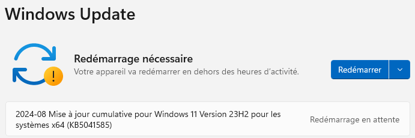

# Sysprep - Erreurs courantes 

## Qu'est-ce que Sysprep ?

Sysprep permet de préparer des "masters" de Windows, des images standard facilement réutilisables.
C'est surtout utilisé en entreprise pour effectuer de nombreux déploiements en un minimum de temps.

Cet utilitaire se trouve dans **C:\Windows\System32\Sysprep.**
Sysprep peut s'utiliser en mode graphique (GUI) ou en ligne de commandes (CLI).

## Consulter les logs de Sysprep

Lorsqu'une erreur survient, Sysprep vous invite à consulter les logs (journaux d'évènements).
Ces logs se trouvent dans le dossier **C:\Windows\System32\Sysprep\Panther**.

Dans le dossier "Panther", vous trouverez le fichier "setupact", il contient tous les évènements.
Mais celui qui nous intéresse est "**setuperr**" car il contient uniquement les erreurs.

Ouvrez le fichier "setuperr" (il faut être admin).
Chaque ligne est horodatée, ce qui permet de repérer l'erreur qui vous intéresse.

Prêtez attention aux **codes erreur Microsoft** qui commencent par **0x** et utilisez-les pour effectuer des recherches sur le Web afin d'en savoir plus sur la cause probable de l'erreur rencontrée.

## Erreurs fréquentes et solutions

### Redémarrage en attente suite mise à jour système

**Erreur indiquée dans le fichier setuperr**:
*"There are one or more Windows updates that require a reboot. To run Sysprep, reboot the computer
and restart the application."*

**Solution :**
Vérifiez dans **Windows Update** si un redémarrage est nécessaire, redémarrez la machine et relancez Sysprep.

### Stockage en cours d'utilisation

**Erreur indiquée dans le fichier setuperr**:
*"Audit mode cannot be turned on if reserved storage is in use. An update or servicing operation may be using reserved storage"*

**Solution:**
Vérifiez dans **Windows Update** que des mises à jour sont en cours de téléchargements et d’installation. Patientez jusqu’à la mise à jour complète du système, redémarrez la machine et relancez Sysprep.

### Bitlocker actif

**Erreur indiquée dans le fichier setuperr**:
*"BitLocker is on for the OS volume. Turn BitLocker off to run Sysprep."*

**Solution 1 : Bitlocker est vraiment activé:**
Allez dans « Ce PC », faites un clic droit sur la partition qui contient le système d’exploitation, 
cliquez sur « Gérer BitLocker » puis sur « Désactiver BitLocker ». 
Une fois désactivé, relancez Sysprep *(un redémarrage avant Sysprep peut être nécessaire)*.

**Solution 2 : Bitlocker n'est pas activé:**
Si BitLocker n’est pas clairement indiqué activé, cela n’empêche pas le **chiffrement du disque**, 
surtout à partir de Windows 11 24h2 qui chiffre automatiquement les données après l’installation de l’OS.

Pour vérifier si le disque est chiffré, ouvrez une invite de commandes et exécutez `manage-bde -status`
Vérifiez que l’état de la conversion ne soit pas « chiffré » ou « en cours de chiffrement ». 
Si c’est le cas, utilisez cette commande pour désactiver ou interrompre le chiffrement:
`manage-bde -off "C:"`

Selon le **pourcentage chiffré**, cette opération d'interruption peut être longue.
Surveillez régulièrement l’état de la conversion avec la première commande jusqu’à ce que ce soit indiqué "**intégralement déchiffre**".

Si vous préférez, vous pouvez faire les **mêmes manipulations** avec des commandes **PowerShell** :
`Get-BitLockerVolume -MountPoint "C:"`
`Disable-BitLocker -MountPoint "C:"`

### Package Microsoft non-provisionné

